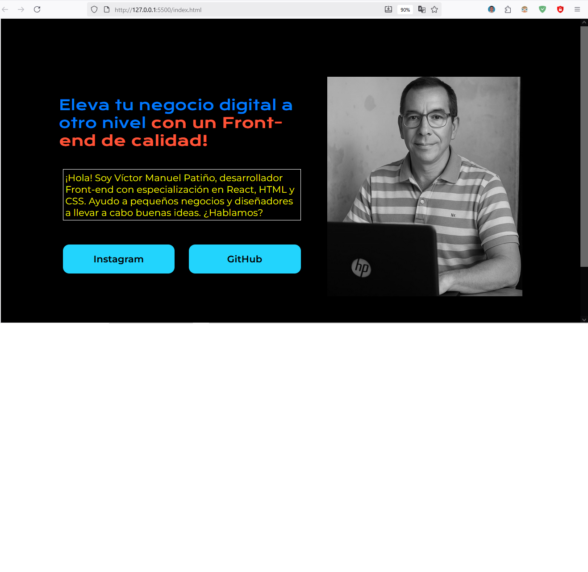

# Portafolio
Es un proyecto en construcción, como práctica académica de mi estudio en Alura LATAM, específicamente el curso de HTML Y CSS.
Partiendo de un modelo (plantilla) posteado en Figma se ha ido editando el código procurando fidelidad a dicho diseño.

# 🌐 Portafolio Web – Víctor Manuel

Este es mi proyecto personal de portafolio desarrollado con **HTML y CSS**.  
El objetivo de este sitio es mostrar mis avances en diseño web, mis proyectos y prácticas como desarrollador en formación.
---
👉 **[Ver Portafolio en GitHub Pages](https://victormanuelpc.github.io/portafolio/)**

---

## 📂 Contenido del proyecto

- `index.html` → Página principal de mi portafolio.  
- `style.css` → Archivo de estilos para dar diseño y estructura visual.  
- `/imagenes` → Carpeta con las imágenes utilizadas en el proyecto.  

---

## 🚀 Características

- Estructura creada con HTML5 semántico.  
- Estilos personalizados en CSS3.  
- Diseño inspirado en un prototipo realizado en Figma.  
- Sección de presentación personal, con mi fotografía y una breve descripción.  
- Preparado para ir integrando nuevos proyectos a medida que avance en mi aprendizaje.  

---

## 🎯 Objetivo

Este portafolio tiene como meta:  
1. Practicar las bases de **HTML y CSS**.  
2. Familiarizarme con la creación de sitios web responsivos.  
3. Tener un espacio para mostrar mis trabajos y avances.  

---

## 📸 Vista previa

  

---

## 🛠️ Tecnologías utilizadas

- **HTML5**  
- **CSS3**  
- **Figma** (como herramienta de diseño y prototipado)  
- **Visual Studio Code**  

---

## 📬 Contacto

👤 **Víctor Manuel**  
✉️ victormanuelpc@ufps.edu.co
🌐 www.linkedin.com/in/victormanuelpc 
